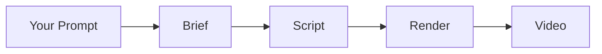

# @talocode/cliploop

**Turn a sentence into a video.** From concept to rendered output — brief, script, render — in one pipeline.

```bash
npm install @talocode/cliploop
```

---

## Why ClipLoop?

Most video creation tools make you jump between 5 different apps to get a finished piece of content. ClipLoop is different — it's a **single prompt-to-video pipeline**.

Describe what you want → get a structured brief → get a scene-by-scene script → submit for render. The entire creative workflow is programmable.

**Who is this for?**
- **Developers** building video generation into their products
- **Content teams** automating short-form video at scale
- **Marketers** creating campaign packages across platforms

---

## How it works



**Brief** — Takes a natural language prompt and produces a structured content plan: hook, structure, tone, target audience.

**Script** — Turns the brief into a scene-by-scene video script with visuals, narration, and timing for each scene.

**Render** — Submits the script to a render engine and returns a downloadable video file.

---

## Quick Start

```bash
# 1. Get a brief for your video idea
cliploop brief --prompt "explain transformers in 60 seconds" --channel youtube

# 2. Generate a script from the brief
cliploop script --brief-id brief_abc123 --style educational

# 3. Render the video
cliploop render --script-id script_def456 --format landscape

# 4. Check status
cliploop status --video-id render_ghi789
```

---

## SDK (in your code)

```typescript
import { generateBrief, generateScript, submitRender } from '@talocode/cliploop'

// Step 1: Generate a content brief
const brief = await generateBrief({
  prompt: 'explain quantum computing in 60 seconds',
  channel: 'youtube',
  duration: 60,
})
// → { id, title, hook, structure, tone, targetAudience }

// Step 2: Generate a scene-by-scene script
const script = await generateScript({
  briefId: brief.id,
  style: 'educational',
})
// → { id, scenes: [{ visual, narration, duration }] }

// Step 3: Submit for rendering
const render = await submitRender({
  scriptId: script.id,
  format: 'landscape',
  quality: 'standard',
})
// → { id, status: 'processing' }

// Step 4: Poll until complete
const status = await getRenderStatus(render.id)
// → { status: 'completed', videoUrl: '...' }
```

---

## CLI Reference

| Command | Description | Required |
|---------|-------------|----------|
| `cliploop brief` | Generate a video content brief | `--prompt` |
| `cliploop script` | Generate a script from a brief | `--brief-id` |
| `cliploop render` | Submit a video for rendering | `--script-id` |
| `cliploop status` | Check render job status | `--video-id` |
| `cliploop campaign` | Create a campaign package | `--name`, `--platform` |

**Options:**
- `--cloud` — Route through Talocode Cloud API (requires `TALOCODE_API_KEY`)
- `--format json|text` — Output format

---

## Campaigns

Bundle multiple videos into a platform-ready campaign:

```bash
cliploop campaign --name "Product Launch Q3" --platform youtube --schedule "2026-08-01T00:00:00Z"
```

---

## Environment

| Variable | Required | Default | Description |
|----------|----------|---------|-------------|
| `MISTRAL_API_KEY` | For local AI | — | Mistral AI API key |
| `TALOCODE_API_KEY` | For cloud mode | — | Talocode Cloud API key |
| `TALOCODE_BASE_URL` | No | `https://api.talocode.site` | API endpoint |

---

## License

MIT
